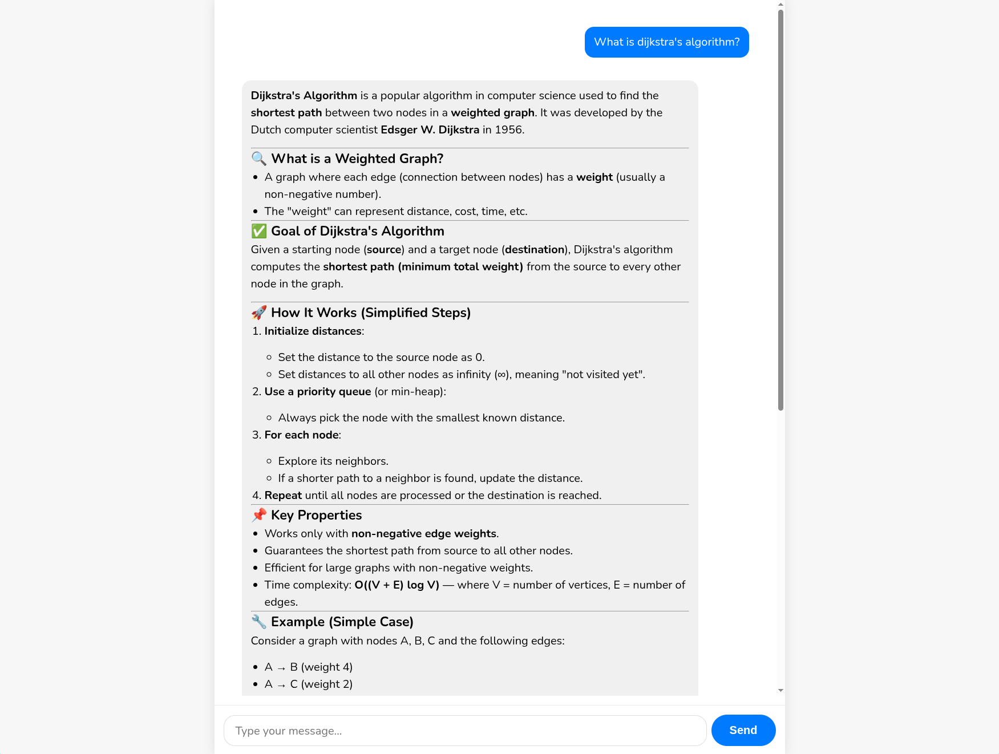

# AI Chat

A simple chatbot interface for self-hosted Large Language Models.



---

### Built With

- **Frontend:** [Vue.js](https://vuejs.org/)
- **Backend:** A self-hosted [Ollama](https://ollama.com/) instance
- **Tunneling:** [Cloudflare Tunnel](https://www.cloudflare.com/products/tunnel/)

---

### Running Your Own Instance

You can run this frontend against your own local Ollama server.

1.  **Clone the repository:**

    ```bash
    git clone <your-repo-url>
    cd ai-chat
    ```

2.  **Install dependencies:**

    ```bash
    npm install
    ```

3.  **Configure your backend URL:**
    Modify the file `.env` in the project root and add your Ollama server's URL.

    ```
    # .env
    VITE_API_URL=http://localhost:11434
    ```

4.  **Run the development server:**
    ```bash
    npm run dev
    ```

---

### ⚠️ Public Demo Disclaimer

The public version of this site connects to a server running on my personal computer. **It will be offline most of the time.**

For a reliable experience, please follow the instructions above to run the chatbot against your own backend.
